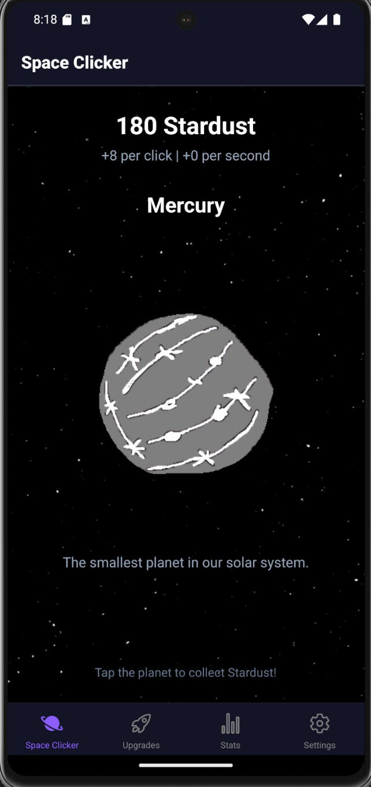
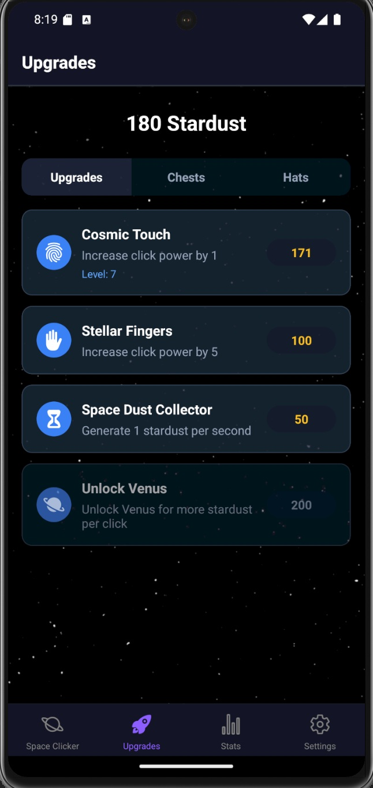
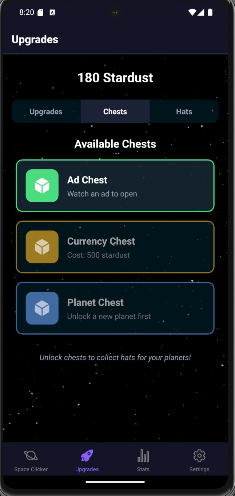
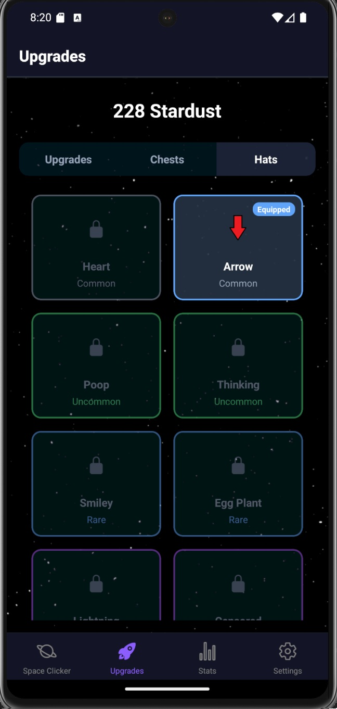
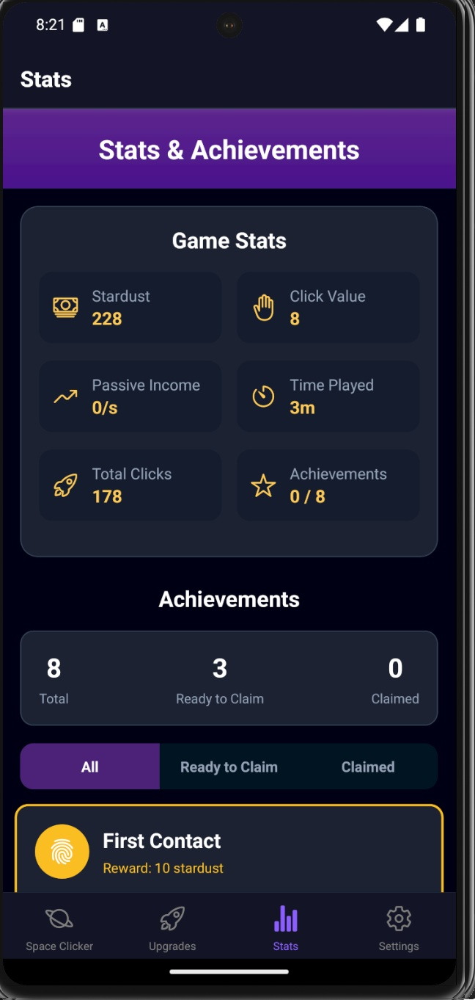
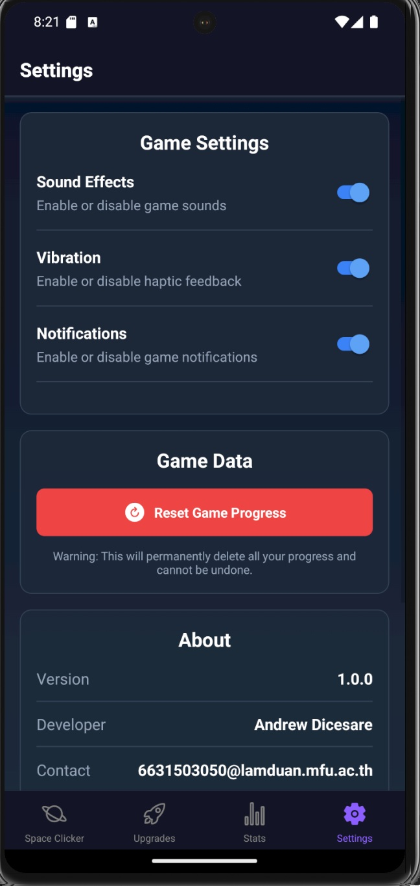

# 📱 แบบฟอร์มส่งงานสอบ Take-home | Take-home Assignment Template
**ชื่อ - นามสกุล (Full Name): Andrew Dicesare**  
**รหัสนักศึกษา (Student ID): 6631503050**  
**ชื่อแอป (App Name): Space Clicker**  
**Framework ที่ใช้ (Framework Used):** React Native
**ลิงก์ GitHub Repository:** [[GITHUB LINK](https://github.com/6631503050Andrew/MobileAppFinal)]  
**ลิงก์ไฟล์ติดตั้ง (APK/IPA):** [[BUILD LINK](https://expo.dev/accounts/andrewdicesare2004/projects/space-clicker/builds/20bc4e6c-cb18-4ad7-b497-2e2fda22f3fa)]

---

## 1. การออกแบบแอป | App Concept and Design (2 คะแนน / 2 pts)

### 1.1 ผู้ใช้งานเป้าหมาย | User Personas  
```markdown
Persona 1:  
- ชื่อ: Sathu  
- อายุ: 12 years old  
- อาชีพ: Student  
- ความต้องการ: Need a simple game where I can destress myself without having to think a lot.

Persona 2:  
- ชื่อ: Ohm  
- อายุ: 21 years old  
- อาชีพ: University student  
- ความต้องการ: Need something to fidget with while doing something else.
```

### 1.2 เป้าหมายของแอป | App Goals  
**ตัวอย่าง (Example):**
```markdown
- A short form of entertainment to help destress users
- Gives a way for users to fidget with while doing another task for when users just want to click on something.
- Simple design to branch out to as many users as possible to generate ad revenue by watching advertisement when opening chests.
```

### 1.3 โครงร่างหน้าจอ / Mockup  
**ใส่รูปภาพ หรือคำอธิบายแต่ละหน้าหลัก 3 หน้า | Attach image or describe 3 main pages**
- Homescreen: The homescreen will display a planet on the center for the users to click on to generate currency. The currency number will be displayed at the top of the screen and along with the planet name.
- Upgrades screen: The upgrades screen will be a basic shop function where users can click on upgrade tabs to purchase upgrades using their currency.
- Stats screen: The stats screen will track and display basic information on what the user has done such as number of clicks, average income per second, . . .
  
### 1.4 การไหลของผู้ใช้งาน | User Flow  
**ตัวอย่าง (Example):**
```markdown
Open application > Click on planet > Click on upgrades section from bottom navigation tab > Click on chosen upgrades > Click on chest section > Click on a chest > Click on Hats section > Click on a hat to equip
```

---

## 2. การพัฒนาแอป | App Implementation (4 คะแนน / 4 pts)

### 2.1 รายละเอียดการพัฒนา | Development Details  
**เครื่องมือที่ใช้ / Tools used:**
```markdown
- React Native (via Expo SDK)
- Expo SDK 52
- JavaScript/ECMAScript 6+
- Node.js

Frameworks & Libraries:
- React Navigation 6+ (Bottom Tab Navigator)
- Expo AV (for audio handling)
- Expo Haptics (for tactile feedback)
- React Native Gesture Handler
- React Native Safe Area Context
- Expo Linear Gradient
- AsyncStorage for data persistence

Development Tools:
- Expo CLI
- EAS (Expo Application Services) for building
- Expo Updates for over-the-air updates

Key Components:
- Context API for state management (GameContext, ToastContext)
- Custom animation system using Animated API
- Custom sound management system
- Achievement and progression system
- Virtual currency and upgrade mechanics
- Hat collection and customization system

Asset Management:
- PNG images for planets and hats
- MP3 audio files for sound effects
- Custom UI components for game interface
```

### 2.2 ฟังก์ชันที่พัฒนา | Features Implemented  
**Checklist:**
```markdown
Core Gameplay:
- [x] Planet clicking system with currency rewards
- [x] Passive income generation
- [x] Multiple planets with different values
- [x] Planet unlocking progression system
- [x] Visual feedback on clicks (animations and numbers)

Upgrade System:
- [x] Click power upgrades (increase currency per click)
- [x] Passive income upgrades (automatic currency generation)
- [x] Planet unlocking upgrades
- [x] Upgrade prerequisites and level requirements
- [x] Multiple upgrade tiers with increasing costs

Achievement System:
- [x] Unlockable achievements based on gameplay milestones
- [x] Achievement rewards (currency bonuses)
- [x] Achievement tracking and progress display
- [x] Visual indicators for unlocked/claimed achievements

Customization:
- [x] Collectible hats system
- [x] Different hat rarities (common to legendary)
- [x] Hat equipping functionality
- [x] Visual display of equipped hats on planets

Chest/Reward System:
- [x] Advertisement chest (watch ad to earn rewards)
- [x] Currency chest (purchase with in-game currency)
- [x] Planet chest (unlock by progressing)
- [x] Random hat rewards from chests

Technical Features:
- [x] Game state persistence (save/load)
- [x] Sound effects system
- [x] Haptic feedback
- [x] Performance optimizations for animations
- [x] Error handling and recovery
- [x] Responsive UI for different screen sizes

Settings & UI:
- [x] Sound toggle
- [x] Vibration toggle
- [x] Notification toggle
- [x] Game reset functionality
- [x] Statistics tracking and display
- [x] Toast notification system

Planned/Future Features:
- [ ] Cloud save functionality
- [ ] Social features (leaderboards, sharing)
- [ ] Special events or limited-time content
- [ ] In-app purchases
- [ ] Daily rewards/login bonuses
```

### 2.3 ภาพหน้าจอแอป | App Screenshots  
**แนบภาพหรือ URL (Attach images or image links):**


 
 
 
 
 
 

 
 [[Images Link Drive]([https://github.com/6631503050Andrew/MobileAppFinal](https://drive.google.com/drive/folders/1MH1Ooe1450J6gd8YkBEJ8A220eJGkbDf?usp=sharing))] 
---

## 3. การ Build และติดตั้งแอป | Deployment (2 คะแนน / 2 pts)

### 3.1 ประเภท Build | Build Type
- [x] Debug  
- [ ] Release  

### 3.2 แพลตฟอร์มที่ทดสอบ | Platform Tested  
- [x] Android  
- [ ] iOS  

### 3.3 ไฟล์ README และวิธีติดตั้ง | README & Install Guide  
**แนบไฟล์หรือคำอธิบายการติดตั้งแอป | Insert steps**
```markdown
1. ดาวน์โหลดไฟล์ .apk
2. เปิดในอุปกรณ์ Android
3. ติดตั้งผ่าน File Manager
```

---

## 4. การสะท้อนผลลัพธ์ | Reflection (2 คะแนน / 2 pts)

**ตัวอย่างหัวข้อ | Suggested points:**
```markdown
- There were many problems with trying to implement a hat feature to correctly display with the planet
- Sounds effects were not correctly working
- When building (over 10 attempts) it keeps showing permission errors where tar wasn't able to access any files from the project.
- Dependency and version conflictions
```

---

## 5. การใช้ AI ช่วยพัฒนา | AI Assisted Development (Bonus / ใช้ประกอบการพิจารณา)

### 5.1 ใช้ AI ช่วยคิดไอเดีย | Idea Generation
```markdown
Prompt ที่ใช้: "I want to develop a cookie clicker like application game where users can click to generate money and use to buy upgrades. What kind of theme should I use and what differences I should make for the app to stand out"

ผลลัพธ์:  
The AI helps to list different themes and ideas for me to choose
```

### 5.2 ใช้ AI ช่วยออกแบบ UI | UI Layout Prompt
```markdown
Prompt ที่ใช้:  
"Create a very simple cookie-clicker-like mobile application using purely javascript. Where instead of cookies it will be space themed and clicking on planets. Include an upgrade screen and stats screen where the upgrades screen will have an additional feature to upgrade planet tiers. Make sure that all the dependencies are latest versions and SDK is latest version and expo is latest version. Make sure the application will be ready for eas build --platform android. I have attached the planet png files."

ผลลัพธ์:  
I got a working simplified version of the app with 4 screens: the home screen, upgrades screen, stats screen, and about section screen
```

### 5.3 ใช้ AI ช่วยเขียนโค้ด | Code Writing Prompt
```markdown
Prompt ที่ใช้:  
"Implement a chest function on the upgrades tab to where users are able to purchase a chest with currency, watch ads, or by upgrading a planet. These chests will contain hats where it cosmetically decorates the planets and will bounce with the planets when the user clicks."

ผลลัพธ์:  
Added the function but with some bugs and issues.
```

### 5.4 ใช้ AI ช่วย debug | Debug Prompt
```markdown
Prompt ที่ใช้:  
"The chest function works correctly however the hats are having trouble displaying on the planets, please modify and resolve the issue to simply display the hat positioned slightly on top of the planet and make it correctly bounce in sync with the planet"

ผลลัพธ์:  
AI correctly displays the hat but doesn't position it correctly, I manually fixed the positioning to make it display slightly on top of the planet correctly.
```

### 5.5 ใช้ AI ช่วย Deploy | Deployment Prompt
```markdown
Prompt ที่ใช้:  
"Prepare my application to be ready to build APK on expo.dev please give a list of instructions to make this possible with minimal issues."

ผลลัพธ์:  
AI gives eas build --platform android --profile preview command showing detailed guides to proceed.
```

---

## ✅ Checklist ก่อนส่ง | Final Checklist
- [x] กรอกข้อมูลครบทุก Section  
- [x] แนบ GitHub และไฟล์ติดตั้ง  
- [x] สะท้อนผล และใช้ AI อย่างมีเหตุผล  
